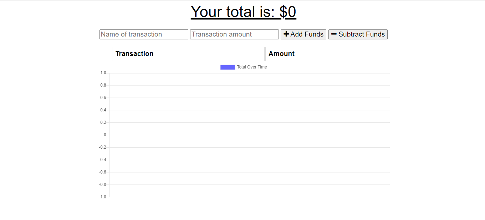
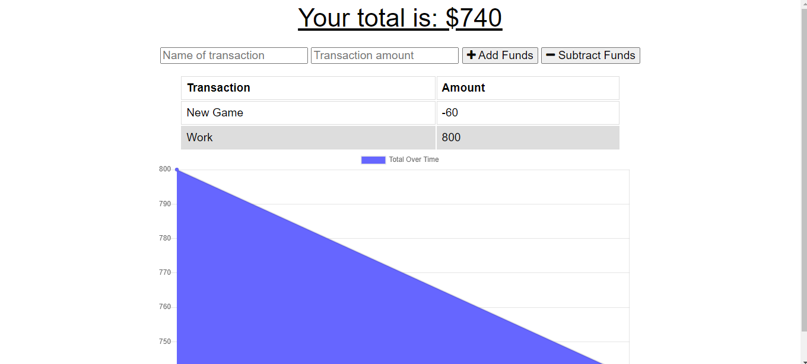

# BudgetTracker

This week was focused on a refactoring activity where the starting frontend and server code was available. My goal was to make the app into a Progressive Web Application(PWA) to allow it to function both online and offline. 

The objectives to complete this Project include the following:
* A user should be able to keep track of their budget while offline
* Withdrawals and deposits can be input offline and when online the transaction history will be added
* Use a manifest, service worker, and indexdb to allow an application to functoin both online and offline

# Online

# Offline

View Live Webpage!
https://vast-ocean-80593.herokuapp.com/